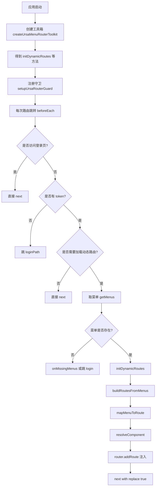
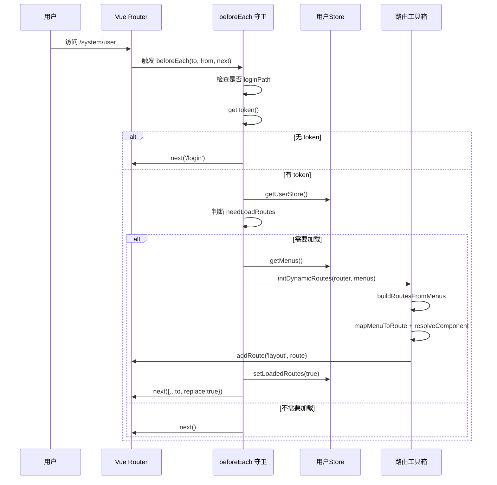

# router/index.js 超详细解读（小白版）

本文对应源码文件：src/router/index.js

目标：
- 解释这份路由工具代码在做什么。
- 解释每个函数的参数、返回值、调用关系。
- 用模拟数据跑一遍，让你知道“数据怎么变成路由”。
- 给出图示，帮助理解整个调用链。

---

## 1. 这份文件整体在做什么

这份文件主要做了 4 件事：
1. 把菜单数据处理成 Vue Router 能识别的路由结构。
2. 处理组件路径字符串，映射到 import.meta.glob 生成的组件模块。
3. 提供一个动态注入路由的工具箱。
4. 提供一个全局前置守卫：未登录跳登录，已登录时按需加载动态路由。

简单说：
后端给菜单 -> 前端转成路由 -> 注入到 layout 下 -> 正常跳转页面。

---

## 2. 先看调用全景图



---

## 3. 参数和返回值总表

| 函数名 | 主要参数 | 返回值 | 作用 |
|---|---|---|---|
| normalizeViewPath | viewPath: string | string | 统一组件路径格式，保证有 .vue 后缀 |
| flattenMenus | menus: array | array | 把树形菜单拍平成单层数组 |
| getFirstMenuPath | menus, options.fallbackPath | string | 获取第一个可用菜单 path |
| createViewResolver | viewModules, viewsDir, debug | function | 返回“根据组件路径找组件模块”的函数 |
| createMenuRouteMapper | resolveComponent, debug | function | 返回“把菜单节点转路由对象”的函数 |
| createUrsaMenuRouterToolkit | options | object | 返回路由工具箱（多个方法） |
| getUrsaMenuIcon | iconName, iconMap, fallbackIcon | icon component | 从图标映射中取图标，失败用兜底 |
| setupUrsaRouterGuard | router, options | guard disposer | 注册 beforeEach 前置守卫 |

---

## 4. 模拟数据（你可以拿来对照理解）

```js
const menus = [
  {
    path: '/system',
    name: 'system',
    component: 'system/index',
    meta: { title: '系统管理', icon: 'Setting' },
    children: [
      {
        path: 'user',
        name: 'system_user',
        component: 'system/user/index',
        meta: { title: '用户管理', icon: 'User' }
      }
    ]
  },
  {
    path: '/report',
    component: 'report/index',
    title: '报表中心'
  }
]

const viewModules = {
  '/src/views/system/index.vue': () => import('/src/views/system/index.vue'),
  '/src/views/system/user/index.vue': () => import('/src/views/system/user/index.vue'),
  '/src/views/report/index.vue': () => import('/src/views/report/index.vue')
}
```

这组数据会被转换出类似：
```js
[
  {
    path: 'system',
    name: 'system',
    component: [Function],
    meta: { title: '系统管理', icon: 'Setting', hidden: false },
    children: [
      {
        path: 'system/user',
        name: 'system_user',
        component: [Function],
        meta: { title: '用户管理', icon: 'User', hidden: false }
      }
    ]
  },
  {
    path: 'report',
    name: 'report_index_vue',
    component: [Function],
    meta: { title: '报表中心', icon: '', hidden: false }
  }
]
```

---

## 5. 守卫时序图（一次真实跳转发生了什么）



---

## 6. 逐行解释（按源码行号）

说明：以下行号对应 src/router/index.js 当前版本。

### 6.1 第 1-10 行：路径标准化

- 第 1 行：引入 Element Plus 全部图标对象，后面做动态取图标。
- 第 2 行：空行，分隔 import 与函数区。
- 第 3 行：注释，说明 normalizeViewPath 的目的。
- 第 4 行：定义 normalizeViewPath，参数 viewPath 默认空字符串。
- 第 5 行：把 viewPath 强制转字符串，并去掉开头所有斜杠。
- 第 6 行：判断去斜杠后是否为空。
- 第 7 行：为空返回空字符串，避免后续拼路径出错。
- 第 8 行：if 结束。
- 第 9 行：如果已有 .vue 后缀直接返回，否则补上 .vue。
- 第 10 行：函数结束。

### 6.2 第 12-37 行：菜单拍平 flattenMenus

- 第 12 行：注释，说明树形转单层。
- 第 13 行：导出 flattenMenus，默认参数 []。
- 第 14 行：防御性判断，非数组直接处理。
- 第 15 行：非数组返回空数组。
- 第 16 行：if 结束。
- 第 17 行：空行，增强可读性。
- 第 18 行：声明结果数组 result。
- 第 19 行：空行。
- 第 20 行：声明递归函数 walk。
- 第 21 行：遍历当前层 items。
- 第 22 行：当前 item 非对象时跳过。
- 第 23 行：return 仅退出本次 forEach 回调。
- 第 24 行：if 结束。
- 第 25 行：空行。
- 第 26 行：结构赋值，把 children 拆出去，剩余字段放 rest。
- 第 27 行：把当前菜单（不含 children）推入结果。
- 第 28 行：空行。
- 第 29 行：如果有 children 且非空。
- 第 30 行：递归 walk(children)。
- 第 31 行：if 结束。
- 第 32 行：forEach 回调结束。
- 第 33 行：walk 函数结束。
- 第 34 行：空行。
- 第 35 行：从顶层开始递归。
- 第 36 行：返回拍平后的结果。
- 第 37 行：flattenMenus 结束。

### 6.3 第 39-44 行：拿第一个可用菜单路径

- 第 39 行：注释，说明 fallbackPath 用法。
- 第 40 行：导出 getFirstMenuPath。
- 第 41 行：从 options 解构 fallbackPath，默认 /dashboard。
- 第 42 行：先拍平，再找第一个 path 为非空字符串的菜单。
- 第 43 行：返回 first.path；没有就返回 fallbackPath。
- 第 44 行：函数结束。

### 6.4 第 46-74 行：创建组件解析器 createViewResolver

- 第 46 行：定义工厂函数 createViewResolver，接收 viewModules、viewsDir、debug。
- 第 47 行：注释，说明要统一 viewsDir 格式。
- 第 48 行：去掉 viewsDir 首尾斜杠，再手动补前导 /。
- 第 49 行：空行。
- 第 50 行：debug 模式判断。
- 第 51 行：输出可用模块 key 列表。
- 第 52 行：if 结束。
- 第 53 行：空行。
- 第 54 行：返回真正解析函数 (viewPath) => component。
- 第 55 行：先把传入组件路径标准化。
- 第 56 行：标准化后为空则无法解析。
- 第 57 行：返回 undefined。
- 第 58 行：if 结束。
- 第 59 行：空行。
- 第 60 行：注释，说明 key 要与 import.meta.glob 产物一致。
- 第 61 行：拼出完整模块 key，如 /src/views/system/index.vue。
- 第 62 行：空行。
- 第 63 行：debug 判断。
- 第 64 行：打印“输入路径 -> 模块 key”。
- 第 65 行：if 结束。
- 第 66 行：空行。
- 第 67 行：从 viewModules 里取组件模块。
- 第 68 行：如果没取到且 debug 开启。
- 第 69 行：打印 warning，提示该 key 不存在。
- 第 70 行：if 结束。
- 第 71 行：空行。
- 第 72 行：返回组件模块（可能 undefined）。
- 第 73 行：内部函数结束。
- 第 74 行：工厂函数结束。

### 6.5 第 76-118 行：菜单节点映射为路由 createMenuRouteMapper

- 第 76 行：定义工厂函数，依赖 resolveComponent。
- 第 77 行：返回 mapper(menu, parentPath) 函数。
- 第 78 行：没有 menu.path 或 menu.component 时直接失败。
- 第 79 行：返回 null，后续会 filter(Boolean) 清理掉。
- 第 80 行：if 结束。
- 第 81 行：空行。
- 第 82 行：把 menu.component 映射成真实组件。
- 第 83 行：组件没找到时处理。
- 第 84 行：debug 判断。
- 第 85 行：打印未找到组件 warning。
- 第 86 行：if 结束。
- 第 87 行：返回 null。
- 第 88 行：if 结束。
- 第 89 行：空行。
- 第 90 行：计算 fullPath，绝对路径保持原样。
- 第 91 行：三元表达式 true 分支。
- 第 92 行：相对路径拼 parentPath，并压缩连续斜杠。
- 第 93 行：fullPath 计算结束。
- 第 94 行：去掉开头 /，变成子路由 path 形式。
- 第 95 行：注释，说明 name 兜底策略。
- 第 96 行：生成 fallbackName：优先 routePath 替换 / 为 _，否则用组件路径替换特殊字符。
- 第 97 行：空行。
- 第 98 行：开始构造 route 对象。
- 第 99 行：route.path。
- 第 100 行：route.name，优先 menu.name。
- 第 101 行：route.component。
- 第 102 行：meta 开始。
- 第 103 行：title 多级兜底（meta.title -> menu_name -> title -> name -> routePath）。
- 第 104 行：icon 多级兜底（meta.icon -> icon -> 空字符串）。
- 第 105 行：hidden 统一转 boolean。
- 第 106 行：meta 结束。
- 第 107 行：route 对象结束。
- 第 108 行：空行。
- 第 109 行：有子菜单时，继续递归生成 children 路由。
- 第 110 行：注释，说明递归目的。
- 第 111 行：route.children 赋值开始。
- 第 112 行：对子节点 map；注意每次递归都新建 mapper 并传 fullPath。
- 第 113 行：过滤 null 节点。
- 第 114 行：if 结束。
- 第 115 行：空行。
- 第 116 行：返回 route。
- 第 117 行：内部 mapper 结束。
- 第 118 行：工厂函数结束。

### 6.6 第 120-170 行：工具箱 createUrsaMenuRouterToolkit

- 第 120 行：导出工具箱创建函数。
- 第 121 行：开始解构 options。
- 第 122 行：viewModules 默认空对象。
- 第 123 行：支持注入自定义 flattenMenus，默认使用本文件函数。
- 第 124 行：viewsDir 默认 /src/views。
- 第 125 行：debug 默认 false。
- 第 126 行：解构结束。
- 第 127 行：空行。
- 第 128 行：创建 resolveComponent。
- 第 129 行：创建 mapMenuToRoute。
- 第 130 行：空行。
- 第 131 行：定义 buildRoutesFromMenus。
- 第 132 行：注释，说明可替换拍平策略。
- 第 133 行：如果 customFlattenMenus 是函数就调用，否则直接用 menus。
- 第 134 行：防御性判断 sourceMenus 是否数组。
- 第 135 行：不是数组返回空。
- 第 136 行：if 结束。
- 第 137 行：逐个菜单映射为 route，并过滤 null。
- 第 138 行：buildRoutesFromMenus 结束。
- 第 139 行：空行。
- 第 140 行：定义 initDynamicRoutes。
- 第 141 行：从 initOptions 取 parentRouteName，默认 layout。
- 第 142 行：空行。
- 第 143 行：校验 router 是否有 addRoute 与 hasRoute。
- 第 144 行：无效 router 时返回空数组。
- 第 145 行：if 结束。
- 第 146 行：空行。
- 第 147 行：先根据菜单构建 routes。
- 第 148 行：空行。
- 第 149 行：遍历 routes。
- 第 150 行：没有 route.name 时跳过。
- 第 151 行：return 跳过当前项。
- 第 152 行：if 结束。
- 第 153 行：空行。
- 第 154 行：注释，避免重复注册。
- 第 155 行：若 router 不存在同名路由。
- 第 156 行：把该路由挂到 parentRouteName 下。
- 第 157 行：if 结束。
- 第 158 行：forEach 结束。
- 第 159 行：空行。
- 第 160 行：返回 routes（便于外部调试/复用）。
- 第 161 行：initDynamicRoutes 结束。
- 第 162 行：空行。
- 第 163 行：返回工具箱对象开始。
- 第 164 行：暴露 normalizeViewPath。
- 第 165 行：暴露 resolveComponent。
- 第 166 行：暴露 mapMenuToRoute。
- 第 167 行：暴露 buildRoutesFromMenus。
- 第 168 行：暴露 initDynamicRoutes。
- 第 169 行：对象结束。
- 第 170 行：工具箱函数结束。

### 6.7 第 172-175 行：菜单图标解析

- 第 172 行：导出 getUrsaMenuIcon。
- 第 173 行：解构 options：iconMap 与 fallbackIcon。
- 第 174 行：优先 iconMap[iconName]，其次 iconMap[fallbackIcon]，再其次 ElementPlusIconsVue.Menu。
- 第 175 行：函数结束。

### 6.8 第 177-183 行：守卫默认策略函数

- 第 177 行：defaultGetMenus，从 store.userInfo.menus 取菜单，缺失返回 []。
- 第 178 行：defaultHasLoadedRoutes，读取 hasLoadedAsyncRoutes 并转布尔。
- 第 179 行：defaultSetLoadedRoutes 定义。
- 第 180 行：如果 store 有 setHasLoadedAsyncRoutes 方法。
- 第 181 行：调用它，写入 loaded 状态。
- 第 182 行：if 结束。
- 第 183 行：函数结束。

### 6.9 第 185-262 行：核心守卫 setupUrsaRouterGuard

- 第 185 行：导出 setupUrsaRouterGuard(router, options)。
- 第 186 行：开始解构 options。
- 第 187 行：getToken 默认返回 null。
- 第 188 行：loginPath 默认 /login。
- 第 189 行：getUserStore 默认返回 null。
- 第 190 行：getMenus 默认 defaultGetMenus。
- 第 191 行：hasLoadedRoutes 默认 defaultHasLoadedRoutes。
- 第 192 行：setLoadedRoutes 默认 defaultSetLoadedRoutes。
- 第 193 行：要求外部传入 initDynamicRoutes。
- 第 194 行：动态路由初始化参数默认 {}。
- 第 195 行：可选 shouldLoadRoutes（自定义“是否需要加载”判定）。
- 第 196 行：可选 onMissingMenus（无菜单时自定义兜底）。
- 第 197 行：debug 默认 false。
- 第 198 行：解构结束。
- 第 199 行：空行。
- 第 200 行：校验 router.beforeEach 是否可用。
- 第 201 行：不可用则抛错，防止静默失败。
- 第 202 行：if 结束。
- 第 203 行：空行。
- 第 204 行：校验 initDynamicRoutes 是否函数。
- 第 205 行：不是函数则抛错。
- 第 206 行：if 结束。
- 第 207 行：空行。
- 第 208 行：注册并返回 router.beforeEach 回调。
- 第 209 行：debug 判断。
- 第 210 行：打印目标路径和路由名。
- 第 211 行：if 结束。
- 第 212 行：空行。
- 第 213 行：目标是登录页。
- 第 214 行：直接放行。
- 第 215 行：return，避免继续执行。
- 第 216 行：if 结束。
- 第 217 行：空行。
- 第 218 行：调用 getToken 获取登录态。
- 第 219 行：注释，说明无 token 直接拦截。
- 第 220 行：没有 token。
- 第 221 行：跳转 loginPath。
- 第 222 行：return 结束本次守卫。
- 第 223 行：if 结束。
- 第 224 行：空行。
- 第 225 行：拿 userStore。
- 第 226 行：空行。
- 第 227 行：计算 needLoadRoutes。
- 第 228 行：如果传了 shouldLoadRoutes，就完全按它的判断。
- 第 229 行：否则使用默认策略：未加载过，或目标无 matched，或目标 name 未注册。
- 第 230 行：表达式结束。
- 第 231 行：若不需要加载动态路由。
- 第 232 行：直接 next 放行。
- 第 233 行：return。
- 第 234 行：if 结束。
- 第 235 行：空行。
- 第 236 行：注释，说明何时注入路由。
- 第 237 行：拿菜单数据。
- 第 238 行：菜单是数组且非空。
- 第 239 行：执行动态注入。
- 第 240 行：如果提供了 setLoadedRoutes。
- 第 241 行：标记“已加载动态路由”。
- 第 242 行：if 结束。
- 第 243 行：注释，说明 replace 的意义。
- 第 244 行：next({...to, replace:true})，避免重复历史记录。
- 第 245 行：return。
- 第 246 行：if 结束。
- 第 247 行：空行。
- 第 248 行：debug 判断。
- 第 249 行：打印“没有菜单数据”。
- 第 250 行：if 结束。
- 第 251 行：空行。
- 第 252 行：如果外部提供 onMissingMenus。
- 第 253 行：调用它获取 fallback。
- 第 254 行：如果 fallback 存在。
- 第 255 行：next(fallback)。
- 第 256 行：return。
- 第 257 行：if 结束。
- 第 258 行：if 结束。
- 第 259 行：空行。
- 第 260 行：最终兜底，跳登录页。
- 第 261 行：beforeEach 回调结束。
- 第 262 行：setupUrsaRouterGuard 函数结束。

---

## 7. 用模拟数据串一次“真实调用过程”

假设你在 main.js 里这样接：

```js
const toolkit = createUrsaMenuRouterToolkit({
  viewModules,
  viewsDir: '/src/views',
  debug: true
})

setupUrsaRouterGuard(router, {
  getToken: () => localStorage.getItem('token'),
  getUserStore: () => userStore,
  initDynamicRoutes: toolkit.initDynamicRoutes,
  getMenus: (store) => store.userInfo.menus
})
```

当你访问 /system/user：
1. 先进入 beforeEach。
2. 如果 token 不存在，直接 next('/login')。
3. token 存在，进入“是否需要加载动态路由”判断。
4. 首次一般 needLoadRoutes = true。
5. 读取 menus。
6. 调用 initDynamicRoutes。
7. initDynamicRoutes 内部先 buildRoutesFromMenus。
8. buildRoutesFromMenus 内部逐个调用 mapMenuToRoute。
9. mapMenuToRoute 内部调用 resolveComponent，把字符串路径变成组件函数。
10. routes 构建完成后 addRoute('layout', route)。
11. 设置 hasLoadedAsyncRoutes = true。
12. 执行 next({...to, replace: true})，重新进入目标页并命中新注册路由。

---

## 8. 小白最容易踩的坑

1. 菜单 component 路径和 viewModules key 对不上。
2. viewsDir 配错，比如写成 src/views（缺少前导 / 也可能被拼接逻辑影响）。
3. 菜单缺 path 或 component，导致该菜单被过滤掉。
4. initDynamicRoutes 没传，setupUrsaRouterGuard 会直接抛错。
5. addRoute 的 parentRouteName 默认是 layout，如果你的主布局路由名不是这个，需要改 initOptions。
6. shouldLoadRoutes 自定义逻辑写错，可能导致每次都重复判断或永远不加载。

---

## 9. 一句话总结

这份代码是“菜单驱动动态路由”的完整基础设施：
- 前半段做“菜单 -> 路由”的纯函数转换。
- 后半段在路由守卫中按登录态和页面命中情况动态注入。
- 通过多处兜底和防御性判断，尽量避免因脏数据导致应用崩溃。
