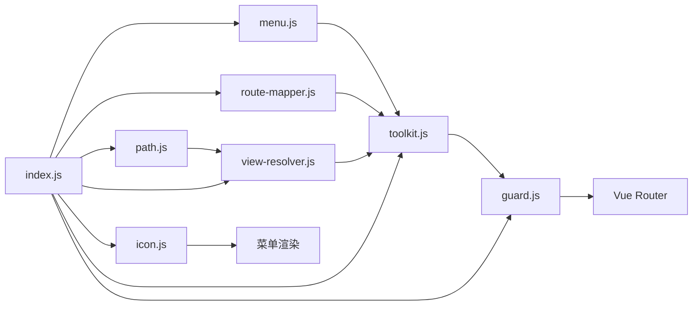
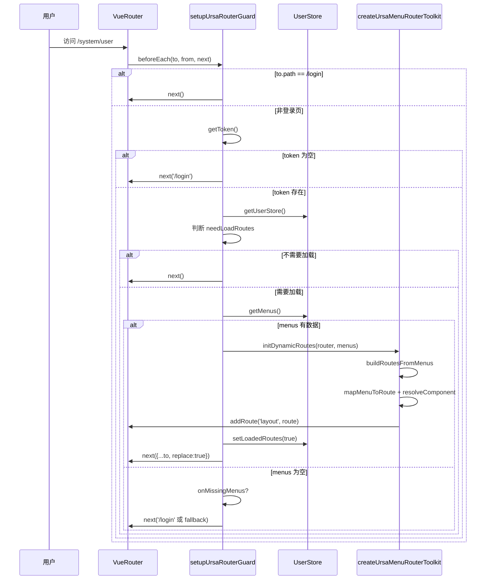

# Router 模块化拆分与 vue-admin 对齐说明

对应工程：ursacomponents  
对应入口：src/router/index.js

本文目标：
1. 说明为什么要拆分原来的 router/index.js。
2. 给出拆分后的文件结构与每个功能点职责。
3. 结合 vue-admin 常见权限路由思路，解释当前实现如何对齐。
4. 给出完整调用流程图、时序图、示例菜单数据、转换结果。
5. 提供迁移与扩展建议，确保后续维护更简单。

---

## 1. 拆分前问题

原先所有逻辑堆在一个文件中，包含：
- 路径字符串处理。
- 菜单树拍平。
- 组件解析（viewModules key 映射）。
- 菜单转路由。
- 动态注入路由。
- 图标映射。
- 全局守卫。

这会带来：
1. 阅读成本高：定位某个能力需要在长文件里反复跳转。
2. 复用困难：比如只想复用菜单拍平逻辑，也要依赖整个大文件。
3. 测试困难：单文件中逻辑耦合太深，难做单元验证。
4. 扩展风险高：改守卫逻辑时容易影响路由转换逻辑。

---

## 2. 拆分后目录结构

```text
src/router/
  index.js                      // 聚合导出入口（对外 API）
  modules/
    path.js                     // 路径标准化
    menu.js                     // 菜单工具（拍平、首菜单）
    view-resolver.js            // 组件解析器（字符串路径 -> 组件模块）
    route-mapper.js             // 菜单节点 -> Vue Route
    toolkit.js                  // 动态路由工具箱（构建与注入）
    icon.js                     // 图标解析
    guard.js                    // 路由前置守卫
```

---

## 3. 文件级功能点拆分（非常具体）

### 3.1 modules/path.js

职责：
- 提供 normalizeViewPath(viewPath)。

规则：
1. 任意输入都先转字符串。
2. 去掉开头斜杠。
3. 空值返回空字符串。
4. 自动补齐 .vue 后缀。

作用：
- 保证菜单里的 component 字段可稳定匹配 import.meta.glob 的 key。

---

### 3.2 modules/menu.js

职责：
- flattenMenus(menus): 树形菜单 -> 单层数组。
- getFirstMenuPath(menus, { fallbackPath }): 获取第一个可用 path。

flattenMenus 细节：
1. 只接受数组，非数组返回 []。
2. 递归遍历 children。
3. 每个节点移除 children 后放入结果。
4. 输出顺序保持 DFS（深度优先）遍历顺序。

getFirstMenuPath 细节：
1. 先 flatten。
2. 找第一个 path 为非空字符串的菜单。
3. 找不到返回 fallbackPath（默认 /dashboard）。

---

### 3.3 modules/view-resolver.js

职责：
- createViewResolver({ viewModules, viewsDir, debug })。
- 返回一个函数 resolveComponent(viewPath)。

关键点：
1. 规范 viewsDir：统一为 /src/views 这种形式。
2. 组合模块 key：`/src/views/${normalizedViewPath}`。
3. 在 viewModules 中查找组件模块。
4. debug 模式打印查找过程和失败 warning。

这部分对应 vue-admin 中“后端返回 component 字符串，前端本地映射组件”的核心逻辑。

---

### 3.4 modules/route-mapper.js

职责：
- createMenuRouteMapper({ resolveComponent, debug })。
- 返回 mapMenuToRoute(menu, parentPath)。

转换规则：
1. menu.path / menu.component 缺失，直接返回 null。
2. resolveComponent 失败，返回 null（并在 debug 警告）。
3. 计算 fullPath：
   - 绝对路径（/xxx）直接使用。
   - 相对路径拼接 parentPath。
4. route.path 去掉开头 /（便于作为 layout 子路由）。
5. route.name 优先 menu.name，缺失时生成 fallbackName。
6. meta.title/icon/hidden 按多级兜底合并。
7. children 递归转换并过滤 null。

---

### 3.5 modules/toolkit.js

职责：
- createUrsaMenuRouterToolkit(options)。
- 提供 5 个方法：
  1. normalizeViewPath
  2. resolveComponent
  3. mapMenuToRoute
  4. buildRoutesFromMenus
  5. initDynamicRoutes

initDynamicRoutes 核心：
1. 校验 router 必须有 addRoute / hasRoute。
2. 先 buildRoutesFromMenus。
3. 遍历 routes，按 name 去重后 addRoute(parentRouteName, route)。
4. 默认 parentRouteName = layout。

对齐 vue-admin 的点：
- 动态路由注入到 layout 下。
- 通过 hasRoute 防重复注册。
- 支持后端菜单差异（可注入 custom flatten）。

---

### 3.6 modules/icon.js

职责：
- getUrsaMenuIcon(iconName, { iconMap, fallbackIcon })。

行为：
1. 优先 iconMap[iconName]。
2. 其次 iconMap[fallbackIcon]。
3. 最后兜底 ElementPlusIconsVue.Menu。

---

### 3.7 modules/guard.js

职责：
- setupUrsaRouterGuard(router, options)。

守卫核心流程：
1. 访问登录页：直接放行。
2. 无 token：跳登录。
3. 有 token：判断是否需要加载动态路由。
4. 需要加载：
   - 取 menus。
   - initDynamicRoutes 注入。
   - setLoadedRoutes(true)。
   - next({ ...to, replace: true }) 避免重复历史。
5. 无菜单：onMissingMenus 回调兜底；再不行跳登录。

这与 vue-admin 常见模式一致：
- 登录态控制 + 权限路由懒注入。
- 首次注入后 replace 重进目标页，解决“目标路由尚未注册”问题。

---

### 3.8 src/router/index.js（聚合入口）

职责：
- 统一 re-export 子模块能力。
- 保持外部导入路径不变（仍然从 ./router/index 获取能力）。

价值：
- 内部可演进拆分，对外 API 稳定。

---

## 4. 与 vue-admin 逻辑的映射关系

| 当前实现能力 | vue-admin 常见能力 | 对齐说明 |
|---|---|---|
| getToken + loginPath 拦截 | permission.js 登录校验 | 无 token 重定向登录 |
| shouldLoadRoutes 判定 | 是否已生成权限路由 | 可自定义或用默认规则 |
| getMenus(store) | 从用户权限/菜单接口取数据 | 菜单驱动而非静态写死 |
| mapMenuToRoute | filterAsyncRoutes / route transform | 字符串 component 映射到真实组件 |
| initDynamicRoutes + addRoute | router.addRoute 动态注册 | 注入 layout 子树 |
| setLoadedRoutes(true) | 标记动态路由已加载 | 避免重复生成 |
| next({ ...to, replace:true }) | 重新进入目标页 | 防止重复历史并确保命中新路由 |

---

## 5. 全链路图示

### 5.1 功能架构图



### 5.2 导航时序图



---

## 6. 示例数据与转换结果

### 6.1 输入菜单（后端返回示例）

```js
const backendMenus = [
  {
    path: '/system',
    name: 'system',
    component: 'system/index',
    meta: { title: '系统管理', icon: 'Setting' },
    children: [
      {
        path: 'user',
        component: 'system/user/index',
        meta: { title: '用户管理', icon: 'User' }
      },
      {
        path: 'role',
        component: 'system/role/index',
        hidden: true,
        title: '角色管理'
      }
    ]
  },
  {
    path: '/dashboard',
    component: 'dashboard/index',
    menu_name: '首页'
  }
]
```

### 6.2 视图模块映射（import.meta.glob 产物示例）

```js
const viewModules = {
  '/src/views/system/index.vue': () => import('/src/views/system/index.vue'),
  '/src/views/system/user/index.vue': () => import('/src/views/system/user/index.vue'),
  '/src/views/system/role/index.vue': () => import('/src/views/system/role/index.vue'),
  '/src/views/dashboard/index.vue': () => import('/src/views/dashboard/index.vue')
}
```

### 6.3 输出路由（关键字段）

```js
[
  {
    path: 'system',
    name: 'system',
    component: [Function],
    meta: { title: '系统管理', icon: 'Setting', hidden: false },
    children: [
      {
        path: 'system/user',
        name: 'system_user_index_vue',
        component: [Function],
        meta: { title: '用户管理', icon: 'User', hidden: false }
      },
      {
        path: 'system/role',
        name: 'system_role_index_vue',
        component: [Function],
        meta: { title: '角色管理', icon: '', hidden: true }
      }
    ]
  },
  {
    path: 'dashboard',
    name: 'dashboard_index_vue',
    component: [Function],
    meta: { title: '首页', icon: '', hidden: false }
  }
]
```

说明：
- 子菜单没传 name 时，会生成稳定 fallbackName。
- title 优先级：meta.title > menu_name > title > name > routePath。

---

## 7. 一次完整接入示例（推荐）

```js
import {
  createUrsaMenuRouterToolkit,
  setupUrsaRouterGuard
} from 'ursacomponents'

const viewModules = import.meta.glob('/src/views/**/*.vue')

const toolkit = createUrsaMenuRouterToolkit({
  viewModules,
  viewsDir: '/src/views',
  debug: false
})

setupUrsaRouterGuard(router, {
  getToken: () => localStorage.getItem('token'),
  getUserStore: () => userStore,
  getMenus: (store) => store.userInfo?.menus || [],
  hasLoadedRoutes: (store) => !!store.hasLoadedAsyncRoutes,
  setLoadedRoutes: (store, loaded) => store.setHasLoadedAsyncRoutes(loaded),
  initDynamicRoutes: toolkit.initDynamicRoutes,
  initDynamicRoutesOptions: { parentRouteName: 'layout' },
  onMissingMenus: () => '/login'
})
```

---

## 8. 拆分后维护建议

1. 业务变更优先改模块，不要回到单文件堆逻辑。
2. 新增策略函数时，优先通过 options 注入，避免写死在 guard/toolkit。
3. 若后端菜单结构变化，优先改 customFlattenMenus 或 mapMenuToRoute，不要改守卫流程。
4. 建议为以下模块补单测：
   - menu.js（拍平与 fallbackPath）
   - view-resolver.js（key 拼接与缺失处理）
   - route-mapper.js（name/meta 兜底）
   - guard.js（token 与动态路由分支）

---

## 9. 本次重构结论

本次已把 router/index.js 按“单一职责”拆成 7 个小模块，并通过聚合入口保持原有对外使用方式不变。整体逻辑与 vue-admin 常见权限路由方案对齐，后续你可以更容易地：
- 排查某个环节（只看一个模块）。
- 按业务定制（通过 options 注入函数）。
- 逐模块做测试与演进（降低改动风险）。
